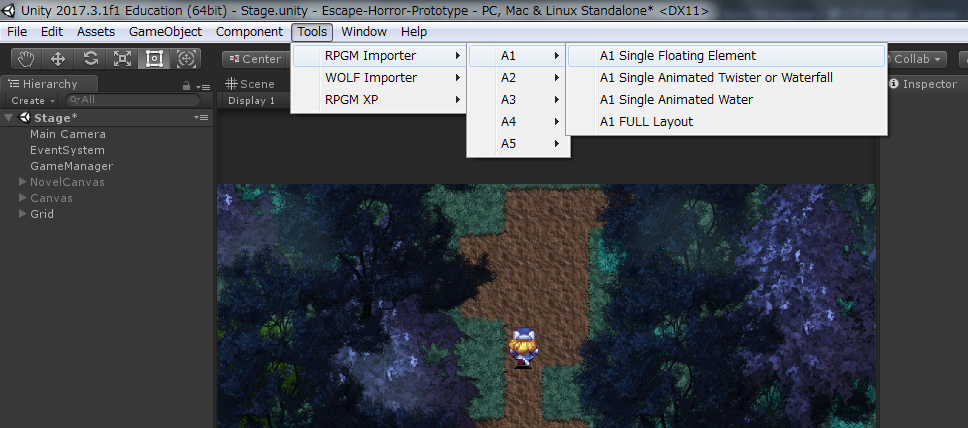
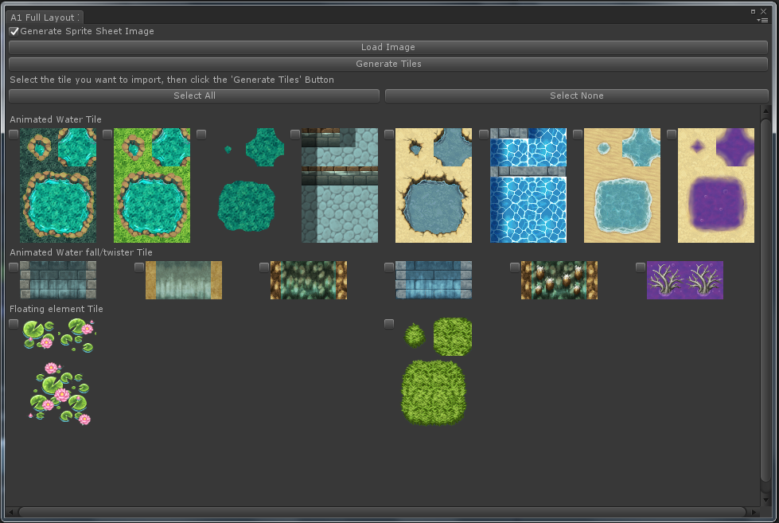
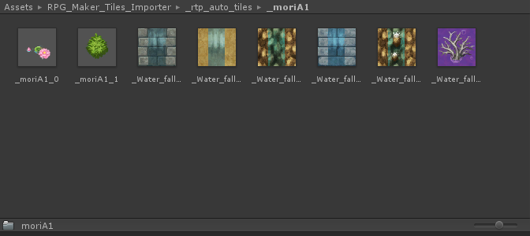

#はじめに
ゲーム制作でRPGツクールのマップチップ素材を使用し、またUnity 2017.3のTilemapを用いることにしたのだが、UnityのTilemapにはツクールのオートタイルに相当するものが2d-extrasのTerrain Tileしかない上、当然ではあるがツクールのオートタイルの仕様と互換性は全くない。
どうしたもんかと頭抱えながらAsset Storeあさってみたら、ものの見事に私のやりたいことまんまのアセットが売っていた。
せっかく見つけたんだしそれほどお高い訳でもなかったので、ちゃちゃっと買って試してみた。

##免責とか
この記事は、このアセットの日本語記事が軽く探した限り見当たらないし、せっかくだから私が書こうじゃないか的なアレです。
紹介している内容に誤りがある可能性があるので、このアセットを使用する場合この記事は参考程度にとどめておき、実際にご自身で購入しご確認ください。

##環境等
この記事での環境は以下の通りです。
- Windows 7 SP1 64bit
- Unity 2017.3.1f
- RPG Maker Auto Tile Impoter 1.6.1

#「[RPG Maker Auto Tile Impoter](https://assetstore.unity.com/packages/tools/sprite-management/rpg-maker-auto-tile-impoter-103504)」とは

- RPGツクール等のオートタイル素材をUnityのTileに変換するエディタ拡張アセット
- 編集時点の価格は＄4（Unity Plus/Unity Proの方は＄3.20）
- 使用できるオートタイル素材
	- 「RPGツクールXP」仕様の素材
	- 「RPGツクールVX・MV」仕様の素材
	- 「WOLF RPGエディター」仕様の素材
- 海・池や滝などのアニメーションにも対応

##注意点
RPGツクールVX・MV使用の素材に関しては、このアセットで変換できるのはAグループのオートタイルのみで、**B、C、D、Eグループは対応しておりません**

#使い方
まず前提として、Asset Storeにてこのアセットを購入し、プロジェクトにインポートしてください。
アセットの購入、プロジェクトへのインポートのやり方・詳細はご自身で調べてください。

##Importerを開く
アセットのインポートに成功すると、UnityのメニューバーにToolsメニューが追加されます。
そのToolsメニューからRPGM Importer→インポートしたいタイルの種類を選びます。

##オートタイル素材を読み込む
開かれたImporterのウィンドウ内のLoad Imageをクリックし、Importerの種類にあったオートタイル画像を開きます。
成功すれば以下のように各オートタイルが表示されます。
（このA1タイルの場合は、この時点で実際にアニメーションしているけど、編集時は動画撮れる環境ではなかったので許してくださいなんでも（ｒｙ）

##オートタイル生成
必要なタイルにチェックを入れ、Generate Tilesボタンをクリックします。
環境にもよりますが、ちょっと待てばプロジェクト内の
Assets/RPG_Maker_Tiles_Importer/_rtp_auto_tiles/素材ファイルの名前
というフォルダが生成され、その中にオートタイルが生成されています。

#まとめ
ぶっちゃけこの記事読むより公式の動画見た方が早いし分かりやすいので、実際参考にする際は公式の紹介動画（英語）をきっちり見た方がいいです（本末転倒）
いずれにせよ、「このアセットは私みたいな状況に陥った人にはとてもおすすめなので、ぜひ購入して2DのRPGとかローグライク作ろうぜ！」というお話でした。

#参考
- [RPG Maker Auto Tile Impoter](https://assetstore.unity.com/packages/tools/sprite-management/rpg-maker-auto-tile-impoter-103504)
- [Unity3D Rpg Maker Tile Importer - Indie Gear Lab](http://www.indiegearlab.com/unity3d-stuff/unity3d-rpg-maker-tile-importer)

#最後に一言

アセット名はImpoterなのに内部フォルダ名はImporterという謎
~~（誤字にマジレスするな）~~
