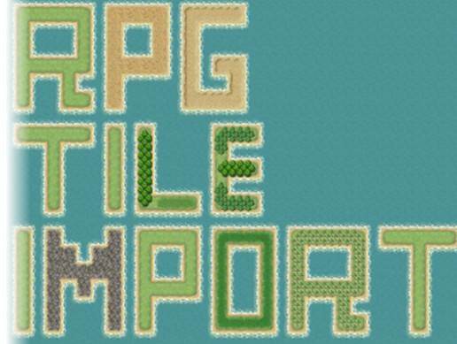

#はじめに
ゲーム制作でRPGツクールのマップチップ素材を使用し、Unity 2017.3のTilemapを用いることにしたのだが、UnityのTilemapにはツクールのオートタイルに相当するものが2d-extrasのTerrain Tileしかない上、当然ではあるがツクールのオートタイルの仕様と互換性は全くなかった。
どうしたもんかと頭抱えながらAsset Storeあさってみたら、ものの見事に私のやりたいことまんまのアセットが売っていた。
せっかく見つけたんだしそれほどお高い訳でもなかったので、ちゃちゃっと買って試してみた。
この記事はそのメモ的なアレである。

#「RPG Maker Auto Tile Impoter」とは
[https://assetstore.unity.com/packages/tools/sprite-management/rpg-maker-auto-tile-impoter-103504](https://assetstore.unity.com/packages/tools/sprite-management/rpg-maker-auto-tile-impoter-103504)

#まとめ
* 

##最後に一言
ImpoterじゃなくてImporterでは……？
