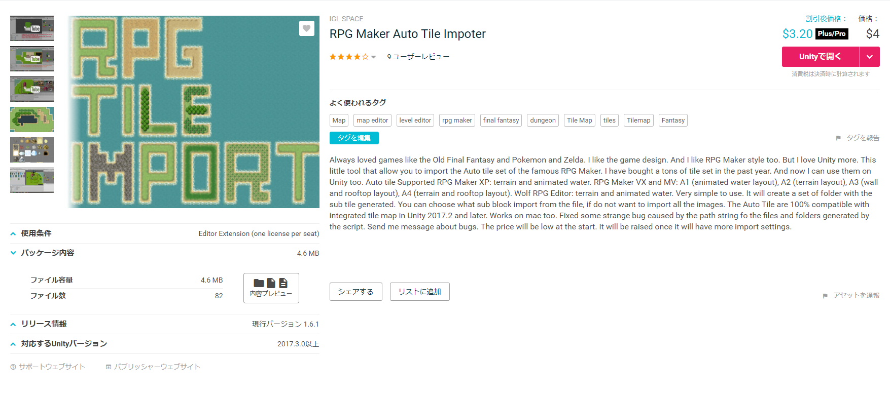
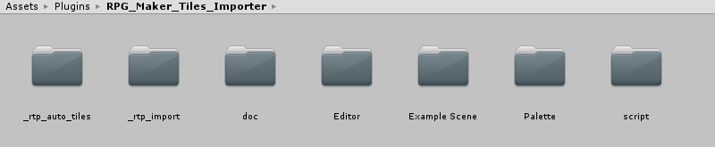

#はじめに
ゲーム制作でRPGツクールのマップチップ素材を使用し、またUnity 2017.3のTilemapを用いることにしたのだが、UnityのTilemapにはツクールのオートタイルに相当するものが2d-extrasのTerrain Tileしかない上、当然ではあるがツクールのオートタイルの仕様と互換性は全くない。
どうしたもんかと頭抱えながらAsset Storeあさってみたら、ものの見事に私のやりたいことまんまのアセットが売っていた。
せっかく見つけたんだしそれほどお高い訳でもなかったので、ちゃちゃっと買って試してみた。

##免責とか
この記事は、このアセットの日本語記事が軽く探した限り見当たらないし、せっかくだから私が書こうじゃないか的なアレです。
紹介している内容に誤りがある可能性があるので、このアセットを使用する場合この記事は参考程度にとどめておき、実際にご自身で購入しご確認ください。

#「[RPG Maker Auto Tile Impoter](https://assetstore.unity.com/packages/tools/sprite-management/rpg-maker-auto-tile-impoter-103504)」とは

- RPGツクール等のオートタイル素材をUnityのTileに変換するエディタ拡張アセット
- 編集時点の価格は$4（Unity Plus/Unity Proの方は$3.20）
- 使用できるオートタイル素材
	- 「RPGツクールXP」仕様の素材
	- 「RPGツクールVX・MV」仕様の素材
	- 「WOLF RPGエディター」仕様の素材
- 海・池や滝などのアニメーションにも対応

#使い方

#最後に一言

アセット名はImpoterなのに内部フォルダ名はImporterという謎
~~（誤字にマジレスするな）~~
